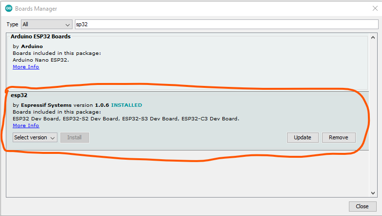

# Rocket_Software
Software for high powered rockets

This repo contains software for high powered rocketry related systems.

Installation:
1. Using Arduino, install the ESP32 boards package by adding this URL to in preferences:
`https://dl.espressif.com/dl/package_esp32_index.json`
Then go to boards manager and install ESP32, specifically:
https://github.com/espressif/arduino-esp32  
Version 1.0.6  
  
If you have later versions installed, be sure to delete them from ...\user\AppData\Local\Arduino15\packages\esp32\hardware\esp32  
because Arduino will automatically select the latest installed version from this folder.
2. Take the libraries folder from this directory and put it into your Arduino folder. Normally in Documents on Windows. 

Currently this contains:
Laika Flight Computer (C++):
- Class libraries (non-functional)
- Laika Flight Computer (functional)

Work to do:
- Implement battery read library for undervoltage cutoff.
- Implement buzzer driver.

Ground station software (Python):
- Graphical user interface (not complete)
- Data collection software
